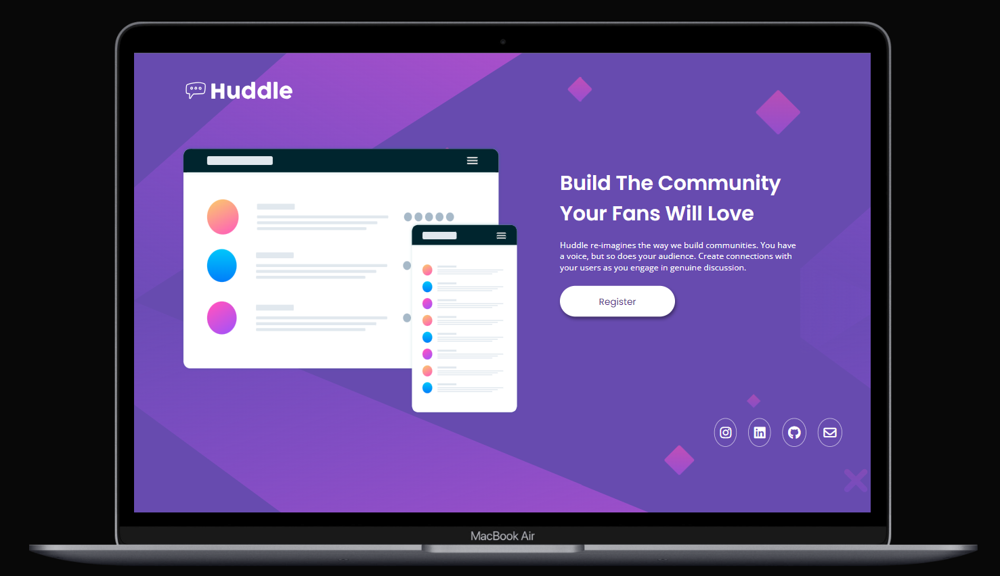
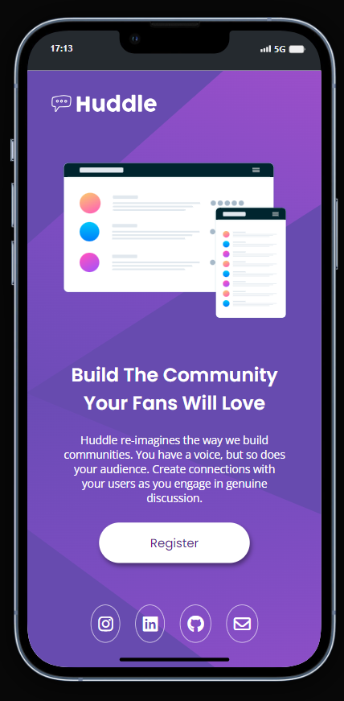

# Frontend Mentor | Huddle landing page 👨‍💻👨‍🔧
Este projeto é um desafio do Frontend Mentor, apresentando um layout de duas colunas. Foi desenvolvido para treinar habilidades em HTML e CSS, criando uma página de aterrissagem responsiva e visualmente atraente.

 

## Demonstração desktop:

 

## Mobile:

 

## Tecnologias utilizadas:
- HTML
- CSS
